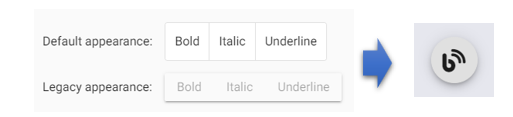

Angular Material トグルボタンの見た目を変更する方法についてです。  
CSS/SCSSを変更する事で見た目を変える事ができるのですが、方法が特殊なため記事として残しておきます。

## 1. How to use Angular Material button-toggle
### Install Angular Material
```bash
ng add @angular/material
```

### Import Angular Material button-toggle  
```ts
import {MatButtonToggleModule} from '@angular/material/button-toggle'
```

### Html  
```ts
<mat-button-toggle [aria-label]="alertsEnabled ? 'Disable alerts' : 'Enable alerts'">
  <mat-icon>notifications</mat-icon>
</mat-button-toggle>
```

詳細は公式ドキュメントを参考にして下さい。  
[Angular Material 公式ドキュメント](https://material.angular.io/components/button-toggle)  

## 2. トグルボタンの見た目を変更
標準のトグルボタンは見た目が四角となっています。  
これを丸いボタンにして、更にクリックしてフォーカスした際のアウトラインが表示されないようにします。

### Html
```html
<mat-button-toggle mat-fab class="toggle-button" aria-label="blog button" #blogButton>
    <span class="toggle-icon fas fa-blog"></span>
</mat-button-toggle>
```

### SCSS
```css
.toggle-button {
    width: 60px;
    height: 60px;
    border-radius: 50% !important;
    box-shadow: 0px 3px 5px -1px rgba(0, 0, 0, 0.2), 0px 6px 10px 0px rgba(0, 0, 0, 0.14), 0px 1px 18px 0px rgba(0, 0, 0, 0.12) !important;
}

.toggle-icon {
    font-size: 30px;
}

:host ::ng-deep .mat-button-toggle-button:focus {
    outline: none;
}
```

  

必要に応じて、SCSSを変更してご利用下さい。